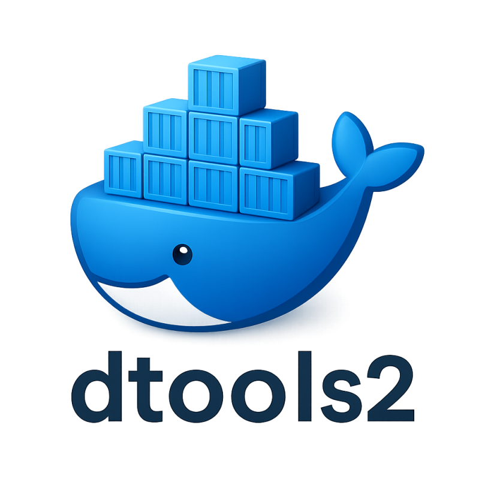
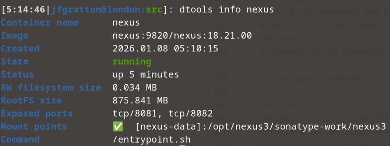
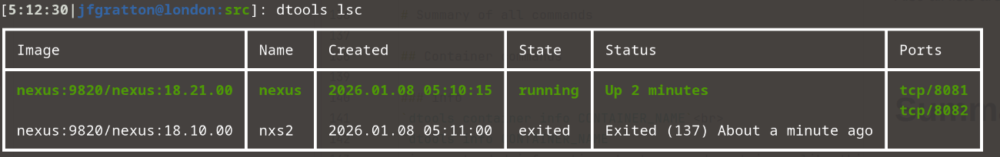
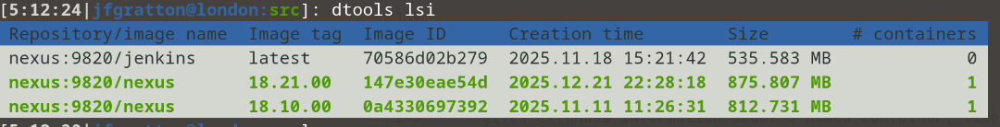
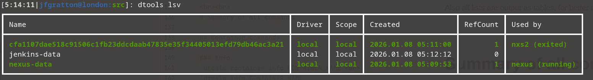

#  dtools2

A drop-in client replacement for the official docker and podman clients
___

# Overview
This tool intends to be a mostly-full replacement of the official docker and podman clients. Mostly-full means that all of the basic features (image/container/volume/network management) will be implemented, but some others might not be.

This tool will not rely on the official GO SDKs, but pure REST API calls. Why ? Some of the reasons, here:
- Docker and Podman REST APIs are nearly identical for my use-case
- The GO SDK (well, docker's, at least) keeps changing data structures, function signatures, etc. I had bad experiences with it when the tool would compile cleanly at one point, then I'd update the dependencies (`go mod tidy`), the SDK would have changed so much that I could not compile the software without extensive refactoring.

Also, the idea behind this tool is to make the TUI more attractive, verbose, informative, than the official clients

# Feature list : what's in it, what isn't

## Features included
- image list, pull, push, removal
- container list, creation, removal, start/stop/restart
- network list, creation, removal, attach, detach
- volume list, creation, removal
- execution (shell in the container)
- system information (in a future version)
- multi-registry auth facilities
- remote daemon connectivity
- http/https aware


## Features not included
- Advanced networking

# New features

## Blacklist
If you wish to protect some resources (images, networks, volumes, containers) from accidental (or bulk) removal<br>
You add a blacklisted resource this way `dtools blacklist add RESOURCE_TYPE RESOURCE_NAME`
- RESOURCE_TYPE are volume, network, image, container
- RESOURCE_NAME is the name of the resource to be blacklisted

Now, if a resource is blacklisted (say, a container named mycontainer) and you still needed it to be removed, you<br>
would use the `-B` flag, this way: `dtools rmc -B mycontainer`

The blacklist file is located in $HOME/.config/JFG/dtools/blacklist.json, and has the following format:
```json
{
  "Volumes": [
    "myvol-1",
    "myvol-2"
  ],
  "Networks": [
    "mynet-1"
  ],
  "Images": [
    "myimage-2:1.00.00",
    "myimage2:latest"
  ],
  "Containers": [
    "mycontainer-1"
  ]
}
```

## Environment
You can define a default image registry so that commands that need fetching information from it in other commands.

You create an environment file with `dtools env add REGISTRY_URL`.<br>The filepath is ~/.config/JFG/dtools/defaultRegistry.json and looks like this:

```json
{
  "RegistryName": "https://nexus:9820",
  "Comments": "Home nexus repository manager",
  "Username": "jfgratton",
  "EncodedPasswd": "Pm75M/5SbsTVkEPVXy+eQjFudEwWgHf0"
}
```
Please note that for now only the RegistryName field is used, the others will be in future releases.

The default registry is used `dtools system catalog` and `dtools system tags`, which are explained below

## List images (catalog) in a remote registry

This is one of the commands that needs the default registry mentioned above. You use it this way:`dtools system catalog`<br>
The output is in JSON, prettified just like `jq` would do:

```json
[2:00:21|jfgratton@london:src]: dtools get catalog
🛈 Connecting to: unix:///var/run/docker.sock

{
  "repositories": [
    "apkbuilder",
    "bare_alpine",
    "forgejo",
    "gitea",
    "haproxy",
    "jenkins",
    "mmost",
    "nexus",
    "nginx",
    "postgresql",
    "rpmbuilder",
    "tracker",
    "vault",
    "vwarden"
  ]
}
```

## List all tags off a specific image
Here's how it'd look:

```bash
[2:00:28|jfgratton@london:src]: dtools get tags nexus
🛈 Connecting to: unix:///var/run/docker.sock

{
  "name": "nexus",
  "tags": [
    "18.00.00",
    "18.01.00",
    "18.05.00",
    "18.06.00",
    "18.10.00",
    "18.20.00",
    "18.20.02",
    "18.21.00",
    "latest"
  ]
}
```

## Prettified output
Most of the commands are prettified with colorized output. We're way past the era of VT220 terminals, might as well use that !<br>
Also all lists are output as tables, for better readability
<br><br>
# Summary of all commands

## Container commands

### info
`dtools container info CONTAINER_NAME`<br>
`dtools info CONTAINER_NAME`
gives extended information about a named container, like this:<br>


### kill/killall, start/startall, stop/stopall, restart/restartall, pause/unpause, rename
*Note:*
You can skip the command name (`container`) from the subcommand, thus `dtools startall` and `dtools container startall` are both valid.<br><br>

These commands do what the name implies, obviously. An extra touch is that you can pass multiple container names to<br>
the kill/start/stop/restart commands:

```bash
[2:08:59|jfgratton@london:src]: dtools kill bareAlpine nexus;dtools up bareAlpine nexus
🛈 Connecting to: unix:///var/run/docker.sock

⏳ Container bareAlpine STOPPED
⏳ Container nexus STOPPED
🛈 Connecting to: unix:///var/run/docker.sock

⏳ Container bareAlpine STARTED
⏳ Container nexus STARTED
```
Notice that `dtools up` is an alias to `dtools start`. Some commands have aliases set that way, explore with -`h`

### list containers
`dtools lsc [-r] [-x]`

This lists all containers on the daemon
- `-r` : only running containers
- `-x` : provides extended information<br>




### remove containers
`dtools container rmc [flags] CONTAINER_NAME`, `dtools rmc [flags] CONTAINER_NAME`

You can chain multiple containers like this: `dtools rmc [flags] CONTAINER1 CONTAINER2 CONTAINER3` etc<br>
The blacklist feature can be applied here<br>

## Image commands

### list images
`dtools lsi`<br>


### pull/push image from/to a remote registry
`dtools image pull REPO:IMAGE:TAG`, `dtools pull REPO:IMAGE:TAG`<br>
`dtools image push REPO:IMAGE:TAG`, `dtools push REPO:IMAGE:TAG`

### tag an image
`dtools image tag IMAGE:TAG IMAGE:NEW_TAG`, `dtools tag IMAGE:TAG IMAGE:NEW_TAG`

### remove an image
`dtools rmi repository/image name:tag` or `dtools rmi image id`<br>
The blacklist feature can be applied here<br>

## Network commands

### list networks
`dtools lsn`<br>


### create networks
`dtools network create [flags] NETWORK_NAME`<br>
The flags are important, have a look at them : `dtools net add -h`

### remove networks
`dtools net remove [flags] NETWORK_NAME`, `dtools net rmn NETWORK_NAME`, `dtools rmn NETWORK_NAME`<br>
You can chain multiple network names to remove them all at once<br>
The blacklist feature can be applied here<br>

### attach/detach a network from a container
`dtools network attach NETWORK_NAME CONTAINER_NAME`, `dtools network detach NETWORK_NAME CONTAINER_NAME`

## Volume commands

### list volumes
`dtools lsv`<br>

<br>
### create volumes
`dtools volume create [-d DRIVER_NAME] VOLUME_NAME`<br>

A very basic support is offered here. Basically, you should create a volume using the `local` driver.<br>
If you have third-party drivers and those do not need any special treatment such as options, etc, you can use that with the `-d` flag<br>

### volume prune
`dtools volume prune`

This will command will remove all unused volumes. A volume is defined as *unused* when its RefCount (ref: `dtools lsv`) is equal to 0<br>
The blacklist feature can be applied here<br>

### volume removal
`dtools rmv VOLUME`

Removes a volume, blacklist feature can be applied here.

## Other commands

### file copy from/to a container
`dtools cp CONTAINER:PATH LOCALPATH`, `dtools cp LOCALPATH CONTAINER:PATH`<br>
... it does what is says :-)

### run a container from an image
`dtools run ARGS`<br>
Runs a container off an image. Mostly like `docker run` does, albeit with a more limited feature set

### build an image
`dtools build ARGS`<br>
Builds an image from the directory (build context) you launch the command from. Limited feature subset for now.<br>
_Podman support is not fully tested_
## Extra features, nice-to-add

### JSON and file output to lists
The commands `lsc`, `lsi`, `lsn`, `lsv` used to respectively list containers, images, networks and volumes can have extra
flags to handle output:

- the `--json` flag informs the client that the output should rendered as a JSON payload
- additionally, if the above `--json` is set, a further `--format KEY_NAME` flag can be used to list only the keys of that name, in plaintext<br>
if `--format` is empty, the flag is ignored
- the `--file FILENAME` can be used to send the output to a file as JSON
- if none of the above flags are present, the output is rendered in a table

## Coming soon

### dtools load/save/export/import

### dtools commit

### support for environment variables (`-e`) in `dtools run`
This really is an oversight of mine. Forgot to include it !