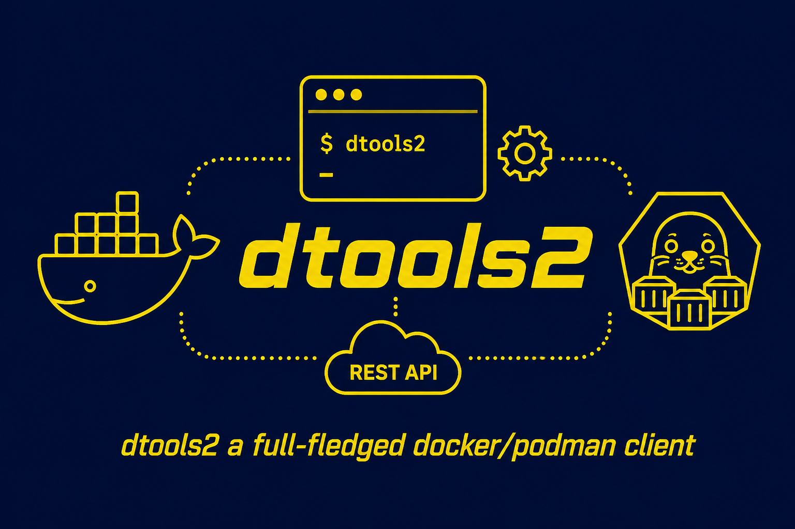

# 

# dtools2

A lightweight Docker/Podman/containerd CLI client. Talks directly to the docker/podman daemon's REST API (no Docker CLI dependency, no wrapper scripts) over a local Unix socket or a remote TCP endpoint (plain or TLS), or to a local containerd daemon over its gRPC API.

---

## Table of Contents

1. [Overview](#overview)
2. [Building](#building)
3. [Configuration](#configuration)
   - [Daemon connection](#daemon-connection)
   - [TLS](#tls)
   - [Default registry](#default-registry)
   - [Blacklist file](#blacklist-file)
4. [Container runtimes](#container-runtimes)
5. [Global flags](#global-flags)
6. [Commands](#commands)
   - [container](#container)
   - [image](#image)
   - [volume](#volume)
   - [network](#network)
   - [run](#run)
   - [build](#build)
   - [exec](#exec)
   - [logs](#logs)
   - [cp](#cp)
   - [login](#login)
   - [blacklist](#blacklist)
   - [env](#env)
   - [get](#get)
   - [system](#system)
   - [backend](#backend)
   - [completion](#completion)
7. [Output control](#output-control)
8. [Blacklist feature](#blacklist-feature)
9. [License](#license)

---

## Overview

`dtools` (binary name) is a single-binary replacement for the Docker CLI for day-to-day container management. It is written in Go and targets Docker and Podman daemons through their shared REST API, and containerd through its native gRPC API — see [Container runtimes](#container-runtimes) for what's supported on each.

Key properties:

- Talks to the docker/podman daemon directly via HTTP over a Unix socket or TCP — no Docker SDK client library in the critical path — or to containerd directly over its local gRPC socket.
- The runtime backend is auto-detected by default: docker/podman is tried first, and dtools falls back to a local containerd only if no docker/podman daemon answers. Force a specific one with `--runtime`.
- API version is auto-negotiated with the docker/podman daemon at startup; you can pin it with `--api-version`.
- Credentials are stored in the standard `~/.docker/config.json` file, compatible with existing tooling.
- A per-user configuration directory is created at `~/.config/JFG/dtools/` on first run.
- A **blacklist** mechanism protects named resources from bulk removal operations.

---

## Building

```sh
./build.sh
```

Or directly:

```sh
go build -o dtools .
```

Requires Go 1.26 or later.

---

## Configuration

### Daemon connection

By default `dtools` connects to `unix:///var/run/docker.sock`. Override with:

- the `--host` / `-H` global flag: `dtools -H tcp://myhost:2376 container lsc`
- the `DOCKER_HOST` environment variable (same syntax, lower priority than the flag)

Supported URI schemes: `unix://`, `tcp://`, `https://`.

`--host` / `-H` only applies to the docker/podman backend — containerd is local-only and has no remote-host equivalent, so `-H` is rejected outright when `--runtime containerd` is set explicitly. See [Container runtimes](#container-runtimes).

### TLS

When connecting over TCP with `--tls` / `-T`, the following flags apply:

| Flag | Description |
|---|---|
| `--tls` / `-T` | Enable TLS for the TCP connection |
| `--ca-cert` | Path to a CA certificate file (for registry login) |
| `--cert` | Path to the client certificate |
| `--key` | Path to the client key |
| `--insecure-skip-verify` | Skip TLS certificate verification |

### Default registry

`dtools` keeps an optional default registry entry in `~/.config/JFG/dtools/defaultRegistry.json`. This is used by `get catalog` and `get tags` when no explicit registry file is provided. Manage it with the [`env`](#env) subcommand.

### Blacklist file

The blacklist is stored in `~/.config/JFG/dtools/blacklist.json`. See the [Blacklist feature](#blacklist-feature) section for details.

---

## Container runtimes

`dtools` talks to one of three backends: **docker**, **podman** (both via the shared REST API) or **containerd** (via its local gRPC API). Which one is used is resolved once per invocation, in this order:

1. If `--runtime docker` or `--runtime podman` is given, the REST backend is used — no probing, no fallback.
2. If `--runtime containerd` is given, the containerd backend is used directly. `-H`/`--host` is rejected in this mode (containerd is local-only).
3. Otherwise (the default), `dtools` auto-detects: it tries the REST backend (docker/podman) first with a short connection timeout; if nothing answers, it falls back to the local containerd socket.

Resolving to docker/podman — whether via an explicit `--runtime` or via the expected auto-detect path — stays silent. A stderr notice (`Using backend: containerd (docker/podman unreachable, fell back to containerd)`) is only printed for the one case worth flagging: auto-detect falling back to containerd because nothing answered on docker/podman. To check which backend is active at any time — including for the silent, expected case — run `dtools backend active`.

```sh
dtools --runtime containerd container lsc     # force containerd
dtools --runtime docker container lsc         # force docker/podman, no fallback
dtools container lsc                          # auto: docker/podman, else containerd
```

### containerd-specific flags

| Flag | Short | Default | Description |
|---|---|---|---|
| `--containerd-socket` | | `/run/containerd/containerd.sock` | containerd gRPC socket path |
| `--namespace` | `-N` | `default` | containerd namespace to operate in |
| `--all-namespaces` | `-A` | `false` | List across every namespace instead of just `--namespace` (list commands only — see below) |

containerd is namespaced, and a real-world install rarely uses the `default` namespace alone — for example, a Kubernetes node's kubelet manages every pod's containers and images through the CRI plugin under the `k8s.io` namespace, not `default`. Point `--namespace` at the right one, e.g.:

```sh
dtools --runtime containerd --namespace k8s.io container lsc
dtools --runtime containerd -A image lsi          # every namespace, with a NAMESPACE column
```

`--all-namespaces` only changes **list** operations (`container lsc`, `image lsi`). Lifecycle and prune operations (`start`, `stop`, `rmc`, `system rms`, `system clean`, etc.) always stay scoped to the single `--namespace` value, even when `-A` is set — sweeping every namespace on the daemon from what's meant to be a targeted or cleanup command would be a surprising blast radius.

### Capability matrix

Not every command has a containerd equivalent. Commands not listed here (`container`, `image`, `system`) work the same way on all three backends.

| Command | docker / podman | containerd |
|---|---|---|
| `network` | ✅ | ❌ not supported — containerd has no native network store (that's CNI's job) |
| `volume` | ✅ | ❌ not supported — containerd has no native named-volume store |
| `run` | ✅ | ❌ not supported — containers must already exist; containerd support is list/inspect/lifecycle only, not creation |
| `build` | ✅ | ❌ not supported — containerd has no build primitive of its own |
| `exec` | ✅ | ❌ not supported |
| `logs` | ✅ | ❌ not supported |
| `attach` | ✅ | ❌ not supported |
| `cp` | ✅ | ❌ not supported — would need a different, snapshot-mount-based mechanism |
| `image load` / `save` / `commit` | ✅ | ❌ not supported — docker archive format doesn't map to containerd's content store |
| `container rename` | ✅ | ❌ not supported — a containerd container's ID is its immutable identity |

Unsupported commands print `"<command>" is not supported by the "containerd" backend` instead of failing silently or half-working.

> **Caution on Kubernetes nodes:** containers under `k8s.io` are managed by kubelet. Stopping, killing, or removing one directly through `dtools` fights the reconciler — kubelet will typically restart or recreate it per the pod's restart policy shortly after, the same way a manual `docker kill` would on a Kubernetes node running the Docker Engine. Treat `dtools` on a live K8s node as an inspection tool (list/inspect), not a substitute for `kubectl`.

---

## Global flags

These flags apply to every subcommand.

| Flag | Short | Default | Description |
|---|---|---|---|
| `--host` | `-H` | `""` (uses `DOCKER_HOST` or the default socket) | Daemon endpoint (`unix://…`, `tcp://…`); docker/podman only, see [Container runtimes](#container-runtimes) |
| `--runtime` | | `""` (auto) | Backend to use: `""`, `docker`, `podman`, or `containerd` |
| `--api-version` | `-V` | `""` (auto-negotiate) | Docker API version to use (e.g. `1.43`) |
| `--containerd-socket` | | `/run/containerd/containerd.sock` | containerd gRPC socket path |
| `--namespace` | `-N` | `default` | containerd namespace to operate in |
| `--all-namespaces` | `-A` | `false` | containerd: list across every namespace (list commands only) |
| `--tls` | `-T` | `false` | Enable TLS for TCP connections |
| `--debug` | `-D` | `false` | Print debug output to stderr |
| `--json` | | `false` | Output JSON instead of formatted tables |
| `--quiet` | `-q` | `false` | Suppress informational output |
| `--fast-fail` | | `30` | HTTP fast-fail timeout in seconds (dial/TLS handshake/headers) |
| `--session-timeout` | | `30` | HTTP session timeout in minutes for long operations (pull/build/cp/save/load); `0` disables it |

To print the version, use the `dtools version` subcommand (there is no longer a bare `-V`/`--version` flag — `-V` is now `--api-version`).

---

## Commands

All subcommands can be invoked directly at the root level **or** under their group command. For example, `dtools lsc` and `dtools container lsc` are equivalent.

---

### container

> **containerd:** list/inspect/lifecycle (`lsc`, `inspect`, `start`, `stop`, `kill`, `pause`, `unpause`, `rmc`, etc.) are supported. `attach` and `rename` are not — see [Container runtimes](#container-runtimes).

Manage containers.

```
dtools container SUBCOMMAND [flags]
```

| Subcommand | Alias | Description |
|---|---|---|
| `lsc` | | List containers |
| `info CONTAINER` | | Show extended info on a container |
| `inspect CONTAINER` | `inspc` | Display detailed inspect output |
| `start CONTAINER…` | `up` | Start one or more containers |
| `startall` | | Start all non-running containers |
| `stop CONTAINER…` | `down` | Stop one or more containers |
| `stopall` | | Stop all running containers |
| `restart CONTAINER…` | | Restart one or more containers |
| `restartall` | | Restart all running containers |
| `kill CONTAINER…` | | Kill one or more containers |
| `killall` | | Kill all running containers |
| `pause CONTAINER…` | | Pause one or more containers |
| `unpause CONTAINER…` | | Unpause one or more containers |
| `rmc CONTAINER…` | | Remove one or more containers |
| `rename OLD NEW` | | Rename a container |
| `attach CONTAINER` | | Attach a TTY to a container |

#### `lsc` flags

| Flag | Short | Default | Description |
|---|---|---|---|
| `--running` | `-r` | `false` | List only running containers |
| `--extended` | `-x` | `false` | Show extended info columns |
| `--file FILE` | `-F` | `""` | Write JSON output to a file |
| `--format FIELDS` | | `""` | Print only the named field(s) as plain text (comma-separated) |

#### `stop` / `stopall` flags

| Flag | Short | Default | Description |
|---|---|---|---|
| `--timeout` | `-t` | `10` | Seconds to wait before killing; `0` stops all containers concurrently |

#### `restart` / `restartall` flags

| Flag | Short | Default | Description |
|---|---|---|---|
| `--kill` | `-k` | `false` | Force-kill instead of graceful stop |

#### `rmc` flags

| Flag | Short | Default | Description |
|---|---|---|---|
| `--force` | `-f` | `false` | Force removal |
| `--remove-vols` | `-r` | `true` | Remove anonymous volumes attached to the container |
| `--blacklist` | `-B` | `false` | Remove even if the container is blacklisted |

---

### image

> **containerd:** `lsi`, `pull`, `push`, `tag`, `rmi`, `inspect` are supported. `load`, `save`, and `commit` are not — see [Container runtimes](#container-runtimes).

Manage images.

```
dtools image SUBCOMMAND [flags]
```

| Subcommand | Alias | Description |
|---|---|---|
| `lsi` | | List images |
| `pull IMAGE` | | Pull an image from a registry |
| `push IMAGE` | | Push an image to a registry |
| `tag IMAGE:TAG IMAGE:NEWTAG` | | Tag an image |
| `rmi IMAGE…` | | Remove one or more images |
| `load TARFILE` | | Load image(s) from a tar archive (xz, gzip, or bzip2 compressed) |
| `save TARFILE IMAGE…` | | Save one or more images to a tar archive (gzip or bzip2 compressed) |
| `commit CONTAINER REPO:TAG` | | Create a new image from a container's changes |
| `inspect IMAGE` | `inspi` | Display detailed inspect output |

#### `lsi` flags

| Flag | Short | Default | Description |
|---|---|---|---|
| `--file FILE` | `-F` | `""` | Write JSON output to a file |
| `--format FIELDS` | | `""` | Print only the named field(s) as plain text (comma-separated) |

#### `pull` flags

| Flag | Short | Default | Description |
|---|---|---|---|
| `--registry HOST` | `-r` | `""` | Registry hostname for authentication (e.g. `registry.example.com:5000`); empty for anonymous |

#### `rmi` flags

| Flag | Short | Default | Description |
|---|---|---|---|
| `--force` | `-f` | `false` | Force removal |
| `--blacklist` | `-B` | `false` | Remove even if the image is blacklisted |

#### `commit` flags

| Flag | Short | Description |
|---|---|---|
| `--author TEXT` | `-a` | Author string |
| `--message TEXT` | `-m` | Commit message |
| `--change INSTRUCTION` | `-c` | Apply a Dockerfile instruction to the new image (repeatable) |

---

### volume

> **containerd:** not supported — see [Container runtimes](#container-runtimes).

Manage volumes. Group alias: `vol`.

```
dtools volume SUBCOMMAND [flags]
```

| Subcommand | Alias | Description |
|---|---|---|
| `lsv` | | List volumes |
| `create NAME` | | Create a volume |
| `rmv VOLUME…` | | Remove one or more volumes |
| `prune` | | Remove unused volumes |
| `inspect VOLUME` | `inspv` | Display detailed inspect output |

#### `lsv` flags

| Flag | Short | Default | Description |
|---|---|---|---|
| `--file FILE` | `-F` | `""` | Write JSON output to a file |
| `--format FIELDS` | | `""` | Print only the named field(s) as plain text (comma-separated) |

#### `create` flags

| Flag | Short | Default | Description |
|---|---|---|---|
| `--driver NAME` | `-d` | `local` | Volume driver |

#### `rmv` flags

| Flag | Short | Default | Description |
|---|---|---|---|
| `--force` | `-f` | `false` | Force removal |
| `--blacklist` | `-B` | `false` | Remove even if blacklisted |

#### `prune` flags

| Flag | Short | Default | Description |
|---|---|---|---|
| `--all` | `-a` | `true` | Remove both anonymous and named volumes |
| `--blacklist` | `-B` | `false` | Remove even if blacklisted |

---

### network

> **containerd:** not supported — see [Container runtimes](#container-runtimes).

Manage networks. Group alias: `net`.

```
dtools network SUBCOMMAND [flags]
```

| Subcommand | Aliases | Description |
|---|---|---|
| `lsn` | | List networks |
| `create NAME` | `add` | Create a network |
| `rmn NETWORK…` | | Remove one or more networks |
| `connect NETWORK CONTAINER` | `attach`, `att`, `con` | Connect a network to a container |
| `disconnect NETWORK CONTAINER` | `detach`, `det`, `disc` | Disconnect a network from a container |
| `inspect NETWORK` | `inspn` | Display detailed inspect output |

#### `lsn` flags

| Flag | Short | Default | Description |
|---|---|---|---|
| `--file FILE` | `-F` | `""` | Write JSON output to a file |
| `--format FIELDS` | | `""` | Print only the named field(s) as plain text (comma-separated) |

#### `create` flags

| Flag | Short | Default | Description |
|---|---|---|---|
| `--driver NAME` | `-d` | `bridge` | Network driver |
| `--ipv6` | `-6` | `false` | Enable IPv6 |
| `--internal` | `-i` | `false` | Restrict external access |
| `--attachable` | `-a` | `false` | Make the network attachable (no effect on bridge networks) |

#### `rmn` flags

| Flag | Short | Default | Description |
|---|---|---|---|
| `--blacklist` | `-B` | `false` | Remove even if blacklisted |

#### `disconnect` flags

| Flag | Short | Default | Description |
|---|---|---|---|
| `--force` | `-f` | `false` | Force-disconnect the network |

---

### run

> **containerd:** not supported — see [Container runtimes](#container-runtimes).

Run a command in a new container.

```
dtools run [flags] IMAGE [COMMAND [ARG...]]
```

```sh
dtools run -it --rm alpine:latest /bin/sh
dtools run -d --name myapi -p 8080:8080 myrepo/myapi:latest
```

| Flag | Short | Default | Description |
|---|---|---|---|
| `--detach` | `-d` | `false` | Run in background; print container ID |
| `--interactive` | `-i` | `false` | Keep STDIN open |
| `--tty` | `-t` | `false` | Allocate a pseudo-TTY |
| `--rm` | | `false` | Remove the container when it exits |
| `--name NAME` | | `""` | Assign a name |
| `--user USER` | `-u` | `""` | Username or UID (`name\|uid[:group\|gid]`) |
| `--workdir DIR` | `-w` | `""` | Working directory inside the container |
| `--env KEY=VAL` | `-e` | | Set environment variables (repeatable) |
| `--publish HOST:CTR` | `-p` | | Publish ports (repeatable) |
| `--volume SRC:DST` | `-v` | | Bind-mount a volume (repeatable) |
| `--mount SPEC` | | | Mount spec, e.g. `type=bind,src=/host,dst=/ctr,ro` (repeatable) |
| `--network NAME` | | `""` | Connect to a network |
| `--entrypoint CMD` | | `""` | Override the image ENTRYPOINT |
| `--hostname NAME` | | `""` | Set the container hostname |
| `--ulimit SPEC` | | | Ulimit setting, e.g. `nofile=1024:2048` (repeatable) |

**Argument ordering.** As with `docker run`, flags must appear **before** the `IMAGE`. Everything after the image name is passed to the container verbatim, so a command may carry its own flags without conflicting with `dtools`:

```sh
dtools run --rm alpine:latest sh -c 'echo hi'   # -c goes to sh, not dtools
```

**Exit code.** In attached mode the container process's exit code is propagated to the caller (like `docker run`), so `dtools run` can be used directly in shell conditionals. If `dtools` or the daemon fails to run the container, the exit code is `125`.

> **Planned for 2.9.0.** Additional resource/security flags — `--memory`, `--cpus`, `--cpu-shares`, `--restart`, `--privileged`, `--cap-add`, `--cap-drop`, `--read-only`, `--shm-size`, and `--pids-limit` — are expected to be fully wired up in a future release (likely dtools 2.9.0).

---

### build

> **containerd:** not supported — see [Container runtimes](#container-runtimes).

Build an image from a Dockerfile.

The builder backend is auto-negotiated with the daemon: modern Docker Engines use **BuildKit** (with live progress output), while older daemons and **Podman** use the classic streaming builder. Force a backend with `DOCKER_BUILDKIT=1` / `DOCKER_BUILDKIT=0`. Registry credentials for private base images are read from `~/.docker/config.json` (honouring credential helpers) for both backends.

```
dtools build [flags] PATH
```

```sh
dtools build -t myimg:latest .
dtools build -t myimg:latest -f Dockerfile.prod --no-cache .
```

| Flag | Short | Default | Description |
|---|---|---|---|
| `--file FILE` | `-f` | `Dockerfile` | Dockerfile path relative to `PATH` |
| `--tag NAME:TAG` | `-t` | | Image name and tag (repeatable) |
| `--build-arg KEY=VAL` | | | Build-time variable (repeatable) |
| `--no-cache` | | `false` | Disable build cache |
| `--pull` | | `false` | Always pull a newer version of base images |
| `--rm` | | `true` | Remove intermediate containers on success |
| `--force-rm` | | `false` | Always remove intermediate containers, even on failure |
| `--compress` | | `false` | Compress the build context |
| `--target STAGE` | | `""` | Build up to a specific stage |
| `--platform PLATFORM` | | `""` | Target platform (if supported by the daemon) |
| `--progress MODE` | | `auto` | Progress output style: `auto`, `plain`, or `tty` |
| `--load` | | `false` | No-op compatibility flag (image is always loaded locally) |

---

### exec

> **containerd:** not supported — see [Container runtimes](#container-runtimes).

Run a command in a running container.

```
dtools exec [flags] CONTAINER COMMAND [ARG...]
```

```sh
dtools exec -it mycontainer /bin/sh
dtools exec -u root mycontainer id
```

| Flag | Short | Default | Description |
|---|---|---|---|
| `--interactive` | `-i` | `false` | Keep STDIN open |
| `--tty` | `-t` | `false` | Allocate a pseudo-TTY |
| `--user USER` | `-u` | `""` | Run as this user or UID |

The process exit code is propagated to the caller.

---

### logs

> **containerd:** not supported — see [Container runtimes](#container-runtimes).

Fetch the logs of a container.

```
dtools logs [flags] CONTAINER
```

```sh
dtools logs -f mycontainer
dtools logs -t -n 200 mycontainer
```

Alias: `log`.

| Flag | Short | Default | Description |
|---|---|---|---|
| `--follow` | `-f` | `false` | Stream log output |
| `--timestamps` | `-t` | `false` | Show timestamps |
| `--tail N` | `-n` | `-1` (all) | Show only the last N lines |

---

### cp

> **containerd:** not supported — see [Container runtimes](#container-runtimes).

Copy a file between the host and a container. Use `container:path` notation for the container side.

```
dtools cp container_name:/path/to/file /host/dest
dtools cp /host/src container_name:/path/to/dest
```

Alias: `copy`.

---

### login

Log in to a container registry. Credentials are verified against the registry's `/v2/` endpoint and stored in `~/.docker/config.json`.

```
dtools login [flags] REGISTRY
```

```sh
dtools login registry.example.com:5000
dtools login -u myuser registry.example.com:5000
```

| Flag | Short | Default | Description |
|---|---|---|---|
| `--username USER` | `-u` | `""` | Registry username (prompted if omitted) |
| `--password PASS` | `-p` | `""` | Registry password (prompted if omitted) |
| `--insecure` | | `false` | Skip TLS certificate verification |
| `--ca-cert FILE` | | `""` | Custom CA certificate file for the registry |

---

### blacklist

Protect named resources from bulk removal operations. Group alias: `bl`.

```
dtools blacklist SUBCOMMAND [flags]
```

| Subcommand | Description |
|---|---|
| `lsb [TYPE]` | List blacklisted resources for the given type, or all (`-a`) |
| `add TYPE NAME…` | Add one or more resources to the blacklist |
| `rmb TYPE NAME…` | Remove one or more resources from the blacklist |

Valid resource types: `volume`, `volumes`, `network`, `networks`, `image`, `images`, `container`, `containers`.

```sh
dtools blacklist add volume mydata mybackup
dtools blacklist lsb -a
dtools blacklist rmb container mycontainer
```

#### `lsb` flags

| Flag | Short | Default | Description |
|---|---|---|---|
| `--all` | `-a` | `false` | List all resource types |

See the [Blacklist feature](#blacklist-feature) section for the full explanation.

---

### env

Manage the default registry configuration stored in `~/.config/JFG/dtools/defaultRegistry.json`. This default registry is used by `get catalog` and `get tags` when no explicit registry file is supplied.

Group alias: `environment`.

```
dtools env SUBCOMMAND [flags]
```

| Subcommand | Alias | Description |
|---|---|---|
| `add REGISTRY_URL [flags]` | | Set a default registry entry |
| `remove` | `rm` | Clear the default registry entry |

#### `add` flags

| Flag | Short | Description |
|---|---|---|
| `--registryfile FILE` | `-r` | Path to the registry config file (default: `~/.config/JFG/dtools/defaultRegistry.json`) |
| `--comment TEXT` | `-c` | Free-form comment |
| `--user USERNAME` | `-u` | Username (stored; currently unused for auto-auth) |
| `--passwd PASSWORD` | `-p` | Password (encoded at rest; currently unused for auto-auth) |

```sh
dtools env add registry.example.com:5000 -c "internal registry"
dtools env remove
```

---

### get

Query a registry directly for image metadata. Reads the default registry from `~/.config/JFG/dtools/defaultRegistry.json` unless overridden.

```
dtools get SUBCOMMAND [flags]
```

| Subcommand | Description |
|---|---|
| `catalog` | Fetch the full image catalog from the default registry (JSON) |
| `tags IMAGE_NAME` | List all tags for a given image |

#### `catalog` flags

| Flag | Short | Description |
|---|---|---|
| `--registryfile FILE` | `-r` | Override the registry config file |
| `--output FILE` | `-o` | Write output to a file |

#### `tags` flags

| Flag | Short | Description |
|---|---|---|
| `--registryfile FILE` | `-r` | Override the registry config file |
| `--file FILE` | `-f` | Write output to a file |

```sh
dtools get catalog
dtools get tags myimage
```

---

### system

System-level housekeeping commands. Group alias: `sys`.

```
dtools system SUBCOMMAND [flags]
```

| Subcommand | Description |
|---|---|
| `rms` | Remove all stopped (exited or created) containers — does **not** touch running or paused ones |
| `clean` | Remove all unused images, volumes, and networks |
| `info` | Show daemon system information (server section) |

> **Note:** `rms` operates on stopped containers only; it is not equivalent to `rmc`, which targets specific named containers.

#### `rms` flags

| Flag | Short | Default | Description |
|---|---|---|---|
| `--force` | `-f` | `false` | Force removal |
| `--remove-vols` | `-r` | `true` | Also remove anonymous volumes |
| `--blacklist` | `-B` | `false` | Remove even if blacklisted |

#### `clean` flags

| Flag | Short | Default | Description |
|---|---|---|---|
| `--force` | `-f` | `false` | Force removal |
| `--blacklist` | `-B` | `false` | Remove even if blacklisted |

---

### backend

Inspect the container runtime backend `dtools` is using — see [Container runtimes](#container-runtimes) for how it's selected.

```
dtools backend SUBCOMMAND
```

| Subcommand | Description |
|---|---|
| `active` | Print the currently selected backend (`docker/podman` or `containerd`) |

```sh
dtools backend active
```

---

### completion

Generate shell completion scripts.

```
dtools completion bash   > /etc/bash_completion.d/dtools
dtools completion zsh    > "${fpath[1]}/_dtools"
```

---

## Output control

Most listing commands support three output modes:

1. **Formatted table** — the default; rendered with `go-pretty`.
2. **JSON** — pass `--json` (global flag) or use `--file FILE` to write JSON directly to a file.
3. **Plain field extraction** — pass `--format FIELD` (or `--format FIELD1,FIELD2`) to print only specific fields, one value per line. Useful for scripting.

```sh
# List all container names as plain text
dtools lsc --format Name

# Write image list as JSON to a file
dtools lsi --json --file images.json
```

---

## Blacklist feature

The blacklist protects named resources (containers, images, volumes, networks) from being deleted by bulk or sweep operations such as `rms`, `clean`, `prune`, and the `*all` variants.

Blacklisted resources are stored by name in `~/.config/JFG/dtools/blacklist.json`. The file is created automatically on first use.

A blacklisted resource **will not** be removed by any bulk command unless the `--blacklist` / `-B` flag is explicitly passed. Targeted removal commands (`rmc`, `rmi`, `rmv`, `rmn`) also respect the blacklist by default.

```sh
# Protect a volume and a container
dtools blacklist add volume pgdata
dtools blacklist add container postgres

# Inspect the blacklist
dtools blacklist lsb -a

# Remove a container that happens to be blacklisted
dtools rmc -B postgres

# Unlist a resource
dtools blacklist rmb volume pgdata
```

---

## License

Copyright © Jean-François Gratton. All rights reserved.
